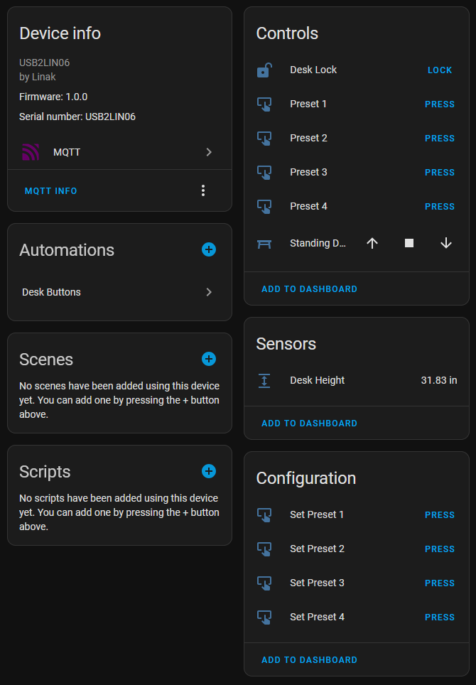

# linak-mqtt-ctrl

A simple Python script to control Linak powered desks and the USB2LIN06 cable over MQTT, with Home Assistant autodiscovery.



Provides desk controls with position set, up/down/stop buttons, preset save/recall, height sensor, and a control lock.  

## Requirements

- Linak desk
- USB2LIN06 device
- Python (>=3.7)
- MQTT server
- Home Assistant (optional)
- `libusb1` library
- `gmqtt` library
- `PyYAML` library

## Installation

There are several ways to install `linak-mqtt-ctrl`.

### Using virtualenv and pip

```shell
$ git clone https://github.com/giantorth/linak-mqtt-ctrl
$ cd linak-mqtt-ctrl
$ python -m venv linak
$ source linak/bin/activate
(linak) $ pip install .
(linak) $ linak-mqtt-ctrl status
Position: 767, height: 78.80cm, moving: False
```

### Install system-wide

```shell
$ sudo pip install .
```

On some systems you will need the `--break-system-packages` option to install or install dependencies from your system repositories and place the script in your `$PATH`.

## Building the Package

The project is built using setuptools. To build the package, simply run from the linak-mqtt-ctrl folder:

```shell
$ pip build .
```

The build configuration is defined in `setup.py` and `setup.cfg`.

## Usage

The script supports three commands: `status`, `move`, and `mqtt`.

### Status

```shell
$ linak-mqtt-ctrl status
Position: 767, height: 78.80cm, moving: False
```

### Move

Adjust the desk height by specifying an absolute position (range: 0-6715):

```shell
$ linak-mqtt-ctrl move 1000
```

Increase verbosity for debugging:

```shell
$ linak-mqtt-ctrl -v move 1000
$ linak-mqtt-ctrl -vv move 1000
```

### MQTT Mode (Service Mode)

The `mqtt` command allows the script to run continuously in service mode, publishing Home Assistant autodiscovery messages.

Basic usage:

```shell
$ linak-mqtt-ctrl mqtt \
   --server <MQTT_SERVER> \
   --port <MQTT_PORT> \
   --username <MQTT_USERNAME> \
   --password <MQTT_PASSWORD> \
   --daemon
```

The --daemon flag will detach the program from the console and continue running.

## Configuration via File

When running in MQTT mode, the script will look for a configuration file at `/etc/linakdesk/config.yaml`. This file can contain MQTT connection options instead of passing via command line. 

File must be writable by service for preset saving to work as they are stored in this file.

Example:

```yaml
server: "mqtt.example.com"
port: 1883
username: "your_username"
password: "your_password"
```


## Running as a Service

You can run `linak-mqtt-ctrl` as a system service by using the provided service file and installation script.

1. Review and adjust [linakdesk.service](linakdesk.service) if necessary. Note that the `WorkingDirectory` and `ExecStart` paths must point to your application.

2. Install the service using the provided script:

   ```shell
   $ sudo bash install_service.sh
   ```

   This script copies the service file to `/etc/systemd/system/`, creates a system user, reloads the systemd configuration, and starts the service. It also adds a udev rule to allow non-root access to the USB device.

To uninstall or stop the service, use standard systemd commands:

```shell
$ sudo systemctl stop linakdesk.service
$ sudo systemctl disable linakdesk.service
```

## Alternatives

There are three projects that perform similar functions. This script was heavily inspired by `linak-ctrl`.

- [`usb2lin06-HID-in-linux-for-LINAK-Desk-Control-Cable`](https://github.com/UrbanskiDawid/usb2lin06-HID-in-linux-for-LINAK-Desk-Control-Cable)
- [`python-linak-desk-control`](https://github.com/monofox/python-linak-desk-control)
- [`linak-ctrl`](https://github.com/gryf/linak-ctrl)

## License

This software is licensed under the 3-clause BSD license. See the LICENSE file for details.

## References

- [`libusb1`](https://github.com/vpelletier/python-libusb1)
- [`gmqtt`](https://github.com/wialon/gmqtt)

---